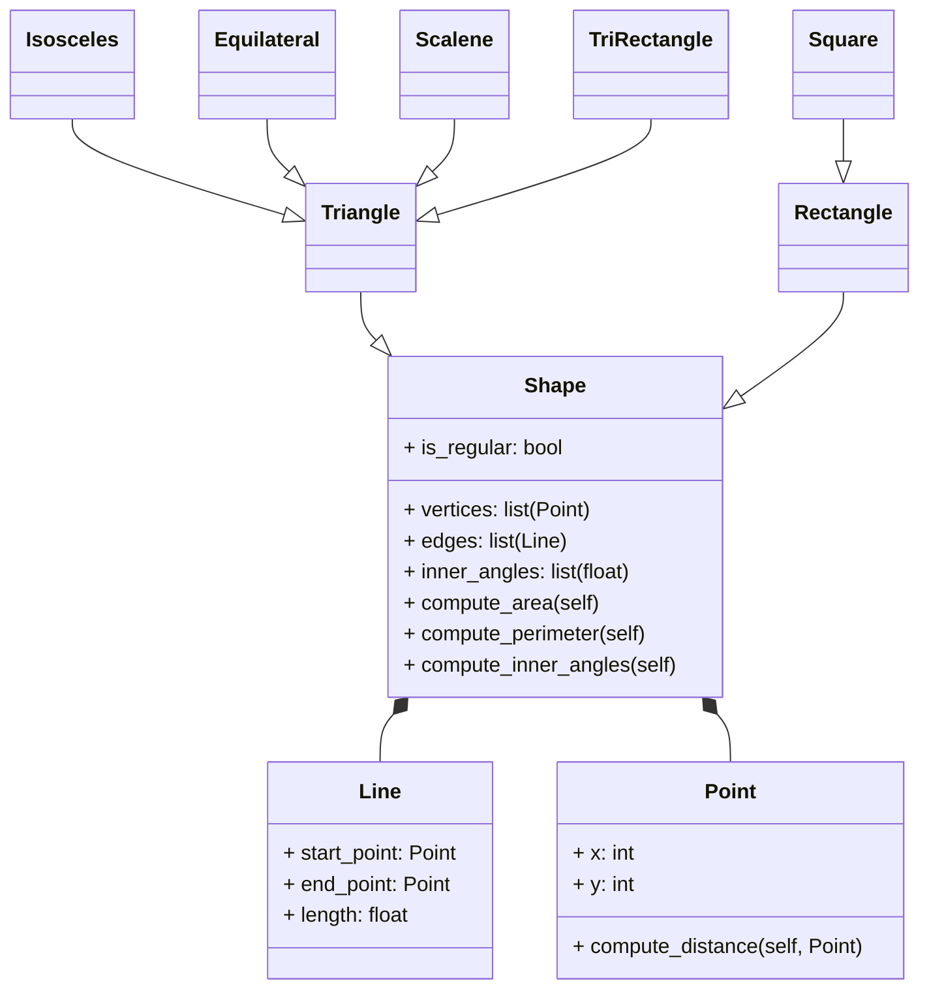

# Reto-04

Este repositorio contiene ejercicios prácticos de POO en Python, documentados y explicados.  

---

## Ejercicio de Clase (`ejercicio_clase.py`)  

Create a superclass called Shape(), which is the base of the classes Reactangle() and Square(), define the methods compute_area and compute_perimeter in Shape() and then using polymorphism redefine the methods properly in Rectangle and in Square.
Using the classes Point() and Line() define a new super-class Shape() with the following structure:


### Código completo

```python
from math import sqrt, asin, acos, pi
class Point:
    def __init__(self, x: float, y: float) -> None:
        self._x = x
        self._y = y

class Line(Point):
    def __init__(self, start: Point, end: Point ) -> None:
        super().__init__(start._x, start._y)
        self._start = start
        self._end = end

    def compute_length(self) -> float:
        length = ((self._end._x - self._start._x) ** 2 + (self._end._y - self._start._y) ** 2) ** 0.5
        return length
    
    def compute_slope(self):
        # Vertical line
        if (self._end.x - self._start.x) == 0:
            return None  
        slope: float = (self._end.y - self._start.y) / (self._end.x - self._start.x)
        return slope
    
    def compute_vertical_crossing(self):
        # Intersection with y-axis (x=0)
        slope = self.compute_slope()
        if slope is None:
            return None
        crossing = self._start.y - (slope * self._start.x)  # y = mx + b  =>  b = y - mx
        return crossing

    def compute_horizontal_crossing(self):
        # Intersection with x-axis (y=0)
        slope = self.compute_slope()
        if slope == 0:
            return None  # Horizontal line has no crossing with x-axis
        if slope is None:
            return None  # Vertical line has no crossing with x-axis
        crossing = -(self._start.y - (slope * self._start.x)) / slope  # y = mx + b  =>  x = (y - b) / m
        return crossing
    
    def __str__(self) -> str:
        slope = self.compute_slope()
        slope_str = f"{slope:.2f}"
        v_cross = self.compute_vertical_crossing()
        h_cross = self.compute_horizontal_crossing()
        return (
            f"Length: {self.compute_length():.2f}, "
            f"Slope: {slope_str}, "
            f"Vertical crossing: {v_cross}, "
            f"Horizontal crossing: {h_cross}"
        )

class Shape():
    def __init__(self, is_regular: bool):
        self.is_regular = is_regular
        self.vertices: list = []
        self.edges: list = []

    def compute_area(self):
        return 0
    
    def compute_perimeter(self):
        if not self.edges:
            return 0
        else:
            for edge in self.edges:
                perimeter = sum(edge.compute_length() for edge in self.edges)
            return perimeter
    
    def inner_angle(self, sides: int) -> float:
        if sides < 3:
            return 0
        return (sides - 2) * 180 / sides # Average inner angle in degrees
    
    def compute_inner_angles(self):
        sides = len(self.vertices)
        if sides < 3:
            return 0
        return (sides-2) * 180
    
        
class Rectangle(Shape):
    def __init__(self, method: int, *args):
        super().__init__(is_regular=False)

        if method == 1:
            # Method 1: Bottom-left + width + height
            bottom_left, width, height = args
            self.width = width
            self.height = height
            self.center = Point(bottom_left._x + width/2, bottom_left._y + height/2)

        elif method == 2:
            # Method 2: Center + width + height
            center, width, height = args
            self.width = width
            self.height = height
            self.center = center

        elif method == 3:
            # Method 3: Two opposite points
            p1, p2 = args
            self.width = abs(p2._x - p1._x)
            self.height = abs(p2._y - p1._y)
            self.center = Point((p1._x + p2._x)/2, (p1._y + p2._y)/2)

        elif method == 4:
            # Method 4: Four lines (composition)
            l1, l2, l3, l4 = args
            lines = [l1, l2, l3, l4]

            points = []
            for line in lines:
                points.append(line._start)
                points.append(line._end)

            xs = []
            ys = []
            for p in points:
                xs.append(p._x)
                ys.append(p._y)

            min_x = min(xs)
            max_x = max(xs)
            min_y = min(ys)
            max_y = max(ys)

            self.width = max_x - min_x
            self.height = max_y - min_y
            self.center = Point((min_x + max_x) / 2, (min_y + max_y) / 2)

        else:
            return "Error: Invalid method"

    def compute_area(self):
        return self.width * self.height

    def compute_perimeter(self):
        return 2 * (self.width + self.height)

    def compute_interference_point(self, point: Point) -> bool:
        x_min = self.center._x - self.width/2
        x_max = self.center._x + self.width/2
        y_min = self.center._y - self.height/2
        y_max = self.center._y + self.height/2
        return x_min <= point._x <= x_max and y_min <= point._y <= y_max


class Square(Rectangle):
    def __init__(self, method: int, *args):
        if method == 1:
            # Method 1: Bottom-left + side
            bottom_left, side = args
            super().__init__(1, bottom_left, side, side)
        elif method == 2:
            # Method 2: Center + side
            center, side = args
            super().__init__(2, center, side, side)
        elif method == 3:
            # Method 3: Two opposite points
            p1, p2 = args
            side = max(abs(p2._x - p1._x), abs(p2._y - p1._y))
            super().__init__(2, Point((p1._x + p2._x) / 2, (p1._y + p2._y) / 2), side, side)
        else:
            raise ValueError("Error: Invalid method")

class Triangle(Shape):
    def __init__(self, p1: Point, p2: Point, p3: Point):
        super().__init__(is_regular=False)
        self.vertices = [p1, p2, p3]
        self.edges = [Line(p1, p2), Line(p2, p3), Line(p3, p1)]
        self.center = Point((p1._x + p2._x + p3._x) / 3, (p1._y + p2._y + p3._y) / 3)
    
    def compute_perimeter(self):
        return super().compute_perimeter()
    
    def compute_area(self):
        a = self.edges[0].compute_length()
        b = self.edges[1].compute_length()
        c = self.edges[2].compute_length()
        s = (a + b + c) / 2  # Semi-perimeter
        area = (s * (s - a) * (s - b) * (s - c)) ** 0.5  # Heron's formula
        return area
    
class IsoscelesTriangle(Triangle):
    def __init__(self, base_point1: Point, base_point2: Point, apex_point: Point):
        self.is_regular = False
        super().__init__(base_point1, base_point2, apex_point)
        if not (self.edges[0].compute_length() == self.edges[1].compute_length() or
                self.edges[1].compute_length() == self.edges[2].compute_length() or
                self.edges[0].compute_length() == self.edges[2].compute_length()):
            raise ValueError("Error: The provided points do not form an isosceles triangle")
    
    def compute_area(self):
        return super().compute_area()
    
    def compute_perimeter(self):
        return super().compute_perimeter()
    
    def compute_inner_angles(self):
        if self.edges[0].compute_length() == self.edges[1].compute_length():
            a = self.edges[0].compute_length()
            b = self.edges[2].compute_length()
        elif self.edges[1].compute_length() == self.edges[2].compute_length():
            a = self.edges[1].compute_length()
            b = self.edges[0].compute_length() 
        else:
            a = self.edges[0].compute_length()
            b = self.edges[1].compute_length()

        test = (b/2)/a
        angle1 = acos(test) * (180 / pi)  # Convert to degrees
        angle2 = angle1
        angle3 = 180 - 2 * angle1
        return angle1, angle2, angle3
    
class Equilateral(Triangle):
    def __init__(self, p_e1: Point, p_e2: Point, p_e3: Point):
        self.is_regular = True
        super().__init__(p_e1, p_e2, p_e3)
    
    def compute_area(self):
        return super().compute_area()
    
    def compute_perimeter(self):
        return super().compute_perimeter()
    
    def compute_inner_angles(self):
        return 60, 60, 60
        
class Scalene(Triangle):
    def __init__(self, p_s1: Point, p_s2: Point, p_s3: Point):
        self.is_regular = False
        super().__init__(p_s1, p_s2, p_s3)
        if (self.edges[0].compute_length() == self.edges[1].compute_length() or
            self.edges[1].compute_length() == self.edges[2].compute_length() or
            self.edges[0].compute_length() == self.edges[2].compute_length()):
            raise ValueError("Error: The provided points do not form a scalene triangle")
    
    def compute_area(self):
        return super().compute_area()
    
    def compute_perimeter(self):
        return super().compute_perimeter()
    
    def compute_inner_angles(self):
        a = self.edges[0].compute_length()
        b = self.edges[1].compute_length()
        c = self.edges[2].compute_length()

        angle1 = acos((b**2 + c**2 - a**2) / (2 * b * c)) * (180 / pi)  # Convert to degrees
        angle2 = acos((a**2 + c**2 - b**2) / (2 * a * c)) * (180 / pi)
        angle3 = 180 - angle1 - angle2
        return angle1, angle2, angle3
#Test
p1 = Point(0, 0)
p2 = Point(4, 0)
p3 = Point(4, 3)
p4 = Point(0, 3)
base_point1 = Point(0, 0)
base_point2 = Point(4, 0)
apex_point = Point(2, 3)
p_e1 = Point(0, 0)
p_e2 = Point(4, 0)
p_e3 = Point(2, (4 * (3 ** 0.5)) / 2)  # Height of equilateral triangle with side 4
p_s1 = Point(0, 0)
p_s2 = Point(4, 0)
p_s3 = Point(3, 5)

# Create 4 lines that form a rectangle
l1 = Line(p1, p2)
l2 = Line(p2, p3)
l3 = Line(p3, p4)
l4 = Line(p4, p1)

print("Test Rectangle")

# Method 1: Bottom-left + width + height
rect1 = Rectangle(1, Point(0, 0), 4, 3)
print("Method 1 -> Area:", rect1.compute_area(), 
      "Perimeter:", rect1.compute_perimeter(), 
      "Center:", (rect1.center._x, rect1.center._y), 
      "inner Angle:", rect1.inner_angle(4))

# Method 2: Center + width + height
rect2 = Rectangle(2, Point(2, 1.5), 4, 3)
print("Method 2 -> Area:", rect2.compute_area(), 
      "Perimeter:", rect2.compute_perimeter(), 
      "Center:", (rect2.center._x, rect2.center._y), 
      "Inner Angle:", rect2.inner_angle(4))

# Method 3: Two opposite points
rect3 = Rectangle(3, Point(0, 0), Point(4, 3))
print("Method 3 -> Area:", rect3.compute_area(), 
      "Perimeter:", rect3.compute_perimeter(), 
      "Center:", (rect3.center._x, rect3.center._y), 
      "inner Angle:", rect3.inner_angle(4))

# Method 4: Four lines
rect4 = Rectangle(4, l1, l2, l3, l4)
print("Method 4 -> Area:", rect4.compute_area(), 
      "Perimeter:", rect4.compute_perimeter(), 
      "Center:", (rect4.center._x, rect4.center._y), 
      "Inner Angle:", rect4.inner_angle(4))

# Test point interference
inside = Point(2, 2)
outside = Point(5, 5)
print("Point (2,2) inside rect4?", rect4.compute_interference_point(inside))
print("Point (5,5) inside rect4?", rect4.compute_interference_point(outside))


print("\nTest Square")

# Method 1: Bottom-left + side
sq1 = Square(1, Point(0, 0), 4)
print("Square Method 1 -> Area:", sq1.compute_area(), 
      "Perimeter:", sq1.compute_perimeter(), 
      "Center:", (sq1.center._x, sq1.center._y),
      "Inner Angle:", sq1.inner_angle(4))

# Method 2: Center + side
sq2 = Square(2, Point(2, 2), 4)
print("Square Method 2 -> Area:", sq2.compute_area(), 
      "Perimeter:", sq2.compute_perimeter(), 
      "Center:", (sq2.center._x, sq2.center._y), 
      "Inner Angle:", sq2.inner_angle(4))

# Method 3: Two opposite points (will adjust to square)
sq3 = Square(3, Point(0, 0), Point(4, 2))
print("Square Method 3 -> Area:", sq3.compute_area(), 
      "Perimeter:", sq3.compute_perimeter(), 
      "Center:", (sq3.center._x, sq3.center._y), 
      "Inner Angle:", sq3.inner_angle(4))


print("\nTest Isosceles Triangle")
iso_tri = IsoscelesTriangle(base_point1, base_point2, apex_point)
print(f"Isosceles Triangle -> Area: {iso_tri.compute_area():.2f} Perimeter: {iso_tri.compute_perimeter():.2f}")
angles = iso_tri.compute_inner_angles()
angles_str = ", ".join(f"{angle:.2f}°" for angle in angles)
print(f"Center: {(iso_tri.center._x, iso_tri.center._y)} Inner Angles: {angles_str}")

print("\nTest Equilateral Triangle")
eq_tri = Equilateral(p_e1, p_e2, p_e3)
print(f"Equilateral Triangle -> Area: {eq_tri.compute_area():.2f} Perimeter: {eq_tri.compute_perimeter():.2f}")
angles_eq = eq_tri.compute_inner_angles()
angles_eq_str = ", ".join(f"{angle:.2f}°" for angle in angles_eq)
print(f"Center: {(eq_tri.center._x, eq_tri.center._y)} Inner Angles: {angles_eq_str}")

print("\nTest Scalene Triangle")
scal_tri = Scalene(p_s1, p_s2, p_s3)
print(f"Scalene Triangle -> Area: {scal_tri.compute_area():.2f} Perimeter: {scal_tri.compute_perimeter():.2f}")
angles_sc = scal_tri.compute_inner_angles()
angles_sc_str = ", ".join(f"{angle:.2f}°" for angle in angles_sc)
print(f"Center: {(scal_tri.center._x, scal_tri.center._y)} Inner Angles: {angles_sc_str}")

```
## Reto 04 (`Reto_04.py`)  

### Enunciado

Escenario de restaurante: Se desea diseñar un programa para calcular la cuenta del pedido de un cliente.
Defina la clase base `MenuItem`: Esta clase debe tener atributos como nombre, precio y un método para calcular el precio total.
Cree subclases para diferentes tipos de elementos del menú: Herede de `MenuItem` y defina propiedades específicas para cada tipo (por ejemplo, `Bebida`, `Aperitivo`, `Plato principal`).
Defina la clase `Orden`: Esta clase debe tener una lista de objetos `MenuItem` y métodos para añadir elementos, calcular el importe total de la cuenta y, potencialmente, aplicar descuentos específicos según la composición del pedido.

El restaurante revisado
Añadir métodos de establecimiento y obtención a todas las subclases para los elementos del menú
Anular `calculate_total_price()` según la composición del pedido (p. ej., si el pedido incluye un plato principal, aplicar un descuento en las bebidas)
Añadir la clase `Payment()` siguiendo el ejemplo de la clase.

---

### Código completo
```python
#Base class for menu items
class MenuItem:
    def __init__(self, name: str, price: float) -> None:
        self._name = name
        self._price = price

    def get_name(self) -> str:
        return self._name

    def get_price(self) -> float:
        return self._price
    
    def set_name(self, name: str) -> None:
        self._name = name

    def set_price(self, price: float) -> None:
        self._price = price

    def calculate_total(self) -> float:
        return self.price

    def __str__(self) -> str:
        return f"{self._name} : ${self.calculate_total()}"

#Beverage subclass
class Beverage(MenuItem):
    def __init__(self, name: str, price: float, size: str) -> None:
        super().__init__(name, price)
        self._size = size

    def get_size(self) -> str:
        return self._size
    
    def set_size(self, size: str) -> None:
        self._size = size

    def calculate_total(self) -> float:
        if self._size.lower() == "big":
            return self._price * 1.2 #20% extra for big size
        elif self._size.lower() == "normal":
            return self._price
        elif self._size.lower() == "small": 
            return self._price * 0.8 # 20% discount for small size

#Appetizer subclass
class Appetizer(MenuItem):
    def __init__(self, name: str, price: float, is_shared: bool) -> None:
        super().__init__(name, price)
        self._is_shared = is_shared

    def get_is_shared(self) -> bool:
        return self._is_shared
    
    def set_is_shared(self, is_shared: bool) -> None:
        self._is_shared = is_shared

    def calculate_total(self) -> float:
        if self._is_shared:
            return self._price * 0.9 # 10% discount for shared appetizers
        return self._price

#MainCourse subclass
class MainCourse(MenuItem):
    def __init__(self, name: str, price: float, side_dish: str) -> None:
        super().__init__(name, price)
        self._side_dish = side_dish

    def calculate_total(self) -> float:
        if self._side_dish.lower() in ["fries", "special salada"]:
            return self._price + 3.0 # Extra cost for special side dishes
        return self._price
    
    def get_side_dish(self) -> str:
        return self._side_dish
    
    def set_side_dish(self, side_dish: str) -> None:
        self._side_dish = side_dish

class Order:
    def __init__(self) -> None:
        self.items: list = []

    def add_item(self, item: MenuItem) -> None:
        self.items.append(item)

    def calculate_total(self) -> float:
        total = 0
        has_main_course: bool = False

        for item in self.items:
            if isinstance(item, MainCourse): #Check if the item is an instance of MainCourse
                has_main_course = True
                break

        for item in self.items:
            total_item = item.calculate_total()
            if has_main_course and isinstance(item, Beverage): #Check if the item is a beverage
                total_item *= 0.9 #10% of discount on beverages

            total += item.calculate_total()
        return total

    def apply_discount(self) -> float:
        total = self.calculate_total()
        if len(self.items) >= 3:
            return total * 0.9 # 10% discount for orders with 3 or more items
        return total

    def __str__(self) -> str:
        text = "--- Pedido ---\n"
        for item in self.items:
            text += f"{item}\n"
        text += f"Total: ${self.apply_discount()}\n"
        return text
    
class Payment:
    def pay(self, amount: float):
        raise NotImplementedError("Subclasses must implement pay()")


class CardPayment(Payment):
    def __init__(self, card_number: str, cvv: int):
        super().__init__()
        self.card_number = card_number
        self.cvv = cvv

    def pay(self, amount: float):
        print(f"Paying ${amount:.2f} with card ending in {self.card_number[-4:]}")


class CashPayment(Payment):
    def __init__(self, cash_given: float):
        super().__init__()
        self.cash_given = cash_given

    def pay(self, amount: float):
        if self.cash_given >= amount:
            print(f"Cash payment made. Change: ${self.cash_given - amount:.2f}")
        else:
            print(f"Insufficient funds. Missing ${amount - self.cash_given:.2f}")
# Create menu
menu = [
    Beverage("Coca-Cola", 5.0, "big"),
    Beverage("Orange juice", 4.0, "normal"),
    Beverage("Mineral water", 2.0, "small"),
    Appetizer("Nachos with cheese", 7.0, True),
    Appetizer("Onion rings", 6.0, False),
    Appetizer("Garlic bread", 4.5, True),
    MainCourse("Hamburger", 12.0, "fries"),
    MainCourse("Margherita pizza", 14.0, "special salad"),
    MainCourse("Bolognese pasta", 11.0, "salad"),
    MainCourse("Grilled chicken", 10.0, "rice")
    ]

# Create an order and add items
order = Order()
order.add_item(menu[0])   # Big Coca-Cola - 20% extra
order.add_item(menu[3])   # Shared Nachos with cheese - 10% discount
order.add_item(menu[6])   # Hamburger with fries - $3 extra
order.add_item(menu[8])   # Pasta with salad - no extra cost

print(order)

# Pay
total = order.apply_discount()
pago_tarjeta = CardPayment("1234567890123456", 321)
pago_tarjeta.pay(total)

pago_efectivo = CashPayment(50)
pago_efectivo.pay(total)

print(order)
```
