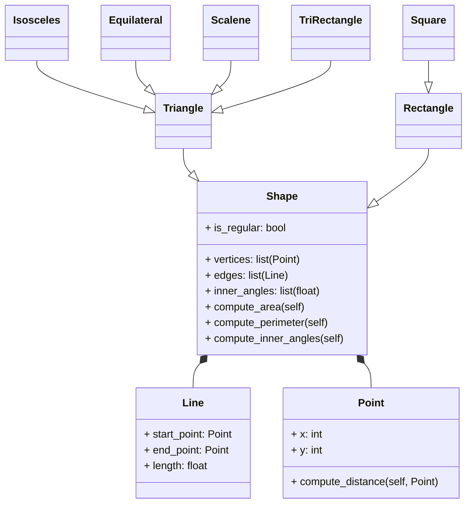

# Reto-04

Este repositorio contiene ejercicios prácticos de POO en Python, documentados y explicados.  

---

## Ejercicio de Clase (`ejercicio_clase.py`)  

Create a superclass called Shape(), which is the base of the classes Reactangle() and Square(), define the methods compute_area and compute_perimeter in Shape() and then using polymorphism redefine the methods properly in Rectangle and in Square.
Using the classes Point() and Line() define a new super-class Shape() with the following structure:


### Código completo

```python
# Point
class Point:
    def __init__(self, x: float, y: float) -> None:
        self.__x = x
        self.__y = y

    def get_x(self) -> float:
        return self.__x

    def get_y(self) -> float:
        return self.__y

    def set_x(self, value: float) -> None:
        self.__x = value

    def set_y(self, value: float) -> None:
        self.__y = value

    def compute_distance(self, other) -> float:
        dx = self.__x - other.get_x()
        dy = self.__y - other.get_y()
        return (dx ** 2 + dy ** 2) ** 0.5

# Line
class Line:
    def __init__(self, start: Point, end: Point) -> None:
        self.__start = start
        self.__end = end

    def get_start(self) -> Point:
        return self.__start

    def get_end(self) -> Point:
        return self.__end

    def set_start(self, p: Point) -> None:
        self.__start = p

    def set_end(self, p: Point) -> None:
        self.__end = p

    def compute_length(self) -> float:
        return self.__start.compute_distance(self.__end)

    def compute_slope(self):
        dx = self.__end.get_x() - self.__start.get_x()
        dy = self.__end.get_y() - self.__start.get_y()
        if dx == 0:
            return None
        return dy / dx

    def compute_vertical_crossing(self):
        slope = self.compute_slope()
        if slope is None:
            return None
        return self.__start.get_y() - slope * self.__start.get_x()

    def compute_horizontal_crossing(self):
        slope = self.compute_slope()
        if slope is None or slope == 0:
            return None
        b = self.__start.get_y() - slope * self.__start.get_x()
        return -b / slope

    def __str__(self) -> str:
        slope = self.compute_slope()
        v_cross = self.compute_vertical_crossing()
        h_cross = self.compute_horizontal_crossing()
        return (
            f"Length: {self.compute_length():.2f}, "
            f"Slope: {slope if slope is not None else 'infinite'}, "
            f"Vertical crossing: {v_cross}, "
            f"Horizontal crossing: {h_cross}"
        )


# Shape
class Shape:
    def __init__(self, is_regular: bool = False):
        self.is_regular = is_regular
        self.vertices = []
        self.edges = []

    def compute_area(self):
        return 0.0

    def compute_perimeter(self):
        if not self.edges:
            return 0.0
        return sum(edge.compute_length() for edge in self.edges)

    def inner_angles(self, sides: int) -> float:
        """Retorna la medida promedio de los ángulos interiores (en grados) de un polígono regular"""
        if sides < 3:
            return 0.0
        return (sides - 2) * 180 / sides

    def compute_inner_angles(self):
        """Devuelve la suma total de ángulos interiores (en grados)"""
        sides = len(self.vertices)
        if sides < 3:
            return 0.0
        return (sides - 2) * 180


class Rectangle(Shape):
    def __init__(self, method: int, *args):
        super().__init__(is_regular=False)

        if method == 1:
            bottom_left, width, height = args
            self.width = width
            self.height = height
            self.center = Point(bottom_left.get_x() + width / 2,
                                bottom_left.get_y() + height / 2)

        elif method == 2:
            center, width, height = args
            self.width = width
            self.height = height
            self.center = center

        elif method == 3:
            p1, p2 = args
            self.width = abs(p2.get_x() - p1.get_x())
            self.height = abs(p2.get_y() - p1.get_y())
            self.center = Point((p1.get_x() + p2.get_x()) / 2,
                                (p1.get_y() + p2.get_y()) / 2)

        elif method == 4:
            l1, l2, l3, l4 = args
            lines = [l1, l2, l3, l4]
            points = []
            for line in lines:
                points.append(line.get_start())
                points.append(line.get_end())
            xs = [p.get_x() for p in points]
            ys = [p.get_y() for p in points]
            min_x, max_x = min(xs), max(xs)
            min_y, max_y = min(ys), max(ys)
            self.width = max_x - min_x
            self.height = max_y - min_y
            self.center = Point((min_x + max_x) / 2, (min_y + max_y) / 2)
        else:
            raise ValueError("Error: Invalid method")

    def compute_area(self):
        return self.width * self.height

    def compute_perimeter(self):
        return 2 * (self.width + self.height)

    def compute_interference_point(self, point: Point) -> bool:
        x_min = self.center.get_x() - self.width / 2
        x_max = self.center.get_x() + self.width / 2
        y_min = self.center.get_y() - self.height / 2
        y_max = self.center.get_y() + self.height / 2
        return x_min <= point.get_x() <= x_max and y_min <= point.get_y() <= y_max


class Square(Rectangle):
    def __init__(self, method: int, *args):
        if method == 1:
            bottom_left, side = args
            super().__init__(1, bottom_left, side, side)
        elif method == 2:
            center, side = args
            super().__init__(2, center, side, side)
        elif method == 3:
            p1, p2 = args
            side = max(abs(p2.get_x() - p1.get_x()), abs(p2.get_y() - p1.get_y()))
            super().__init__(2, Point((p1.get_x() + p2.get_x()) / 2,
                                      (p1.get_y() + p2.get_y()) / 2),
                             side, side)
        else:
            raise ValueError("Error: Invalid method")

    def compute_area(self):
        return self.width ** 2

    def compute_perimeter(self):
        return 4 * self.width


# Triangles
class Triangle(Shape):
    def __init__(self, p1: Point, p2: Point, p3: Point):
        super().__init__(is_regular=False)
        self.vertices = [p1, p2, p3]
        self.edges = [
            Line(p1, p2),
            Line(p2, p3),
            Line(p3, p1)
        ]

    def compute_perimeter(self):
        if not self.edges:
            return 0.0 # Check edges
        return sum(edge.compute_length() for edge in self.edges)

    def compute_area(self):
        a, b, c = [edge.compute_length() for edge in self.edges]
        s = (a + b + c) / 2
        return (s * (s - a) * (s - b) * (s - c)) ** 0.5  # Heron


class Isosceles(Triangle):
    def __init__(self, base: Line, vertex: Point):
        super().__init__(base.get_start(), base.get_end(), vertex)
        self.is_regular = False

    def compute_area(self):
        base_length = self.edges[0].compute_length()
        side_length = self.edges[1].compute_length()
        h = (side_length ** 2 - (base_length ** 2) / 4) ** 0.5
        return (base_length * h) / 2


class Equilateral(Triangle):
    def __init__(self, base_point: Point, side_length: float):
        p1 = base_point
        p2 = Point(p1.get_x() + side_length, p1.get_y())
        height = (3 ** 0.5 / 2) * side_length
        p3 = Point(p1.get_x() + side_length / 2, p1.get_y() + height)
        super().__init__(p1, p2, p3)
        self.is_regular = True

    def compute_area(self):
        side = self.edges[0].compute_length()
        return (3 ** 0.5 / 4) * (side ** 2)


class Scalene(Triangle):
    def __init__(self, p1: Point, p2: Point, p3: Point):
        super().__init__(p1, p2, p3)
        self.is_regular = False


class TriRectangle(Triangle):
    def __init__(self, p1: Point, p2: Point, p3: Point):
        super().__init__(p1, p2, p3)
        self.is_regular = False

    def compute_area(self):
        x1, y1 = self.vertices[0].get_x(), self.vertices[0].get_y()
        x2, y2 = self.vertices[1].get_x(), self.vertices[1].get_y()
        x3, y3 = self.vertices[2].get_x(), self.vertices[2].get_y()
        return abs(x1*(y2 - y3) + x2*(y3 - y1) + x3*(y1 - y2)) / 2  # Determinant


# Tests
p1 = Point(0, 0)
p2 = Point(4, 0)
p3 = Point(4, 3)
p4 = Point(0, 3)

l1 = Line(p1, p2)
l2 = Line(p2, p3)
l3 = Line(p3, p4)
l4 = Line(p4, p1)

print("Rectangle Tests")
rect1 = Rectangle(1, Point(0, 0), 4, 3)
print("Area:", rect1.compute_area(), "Perimeter:", rect1.compute_perimeter())

rect4 = Rectangle(4, l1, l2, l3, l4)
inside = Point(2, 2)
outside = Point(5, 5)
print("Inside?", rect4.compute_interference_point(inside))
print("Outside?", rect4.compute_interference_point(outside))

print("\nSquare Tests")
sq1 = Square(1, Point(0, 0), 4)
print("Area:", sq1.compute_area(), "Perimeter:", sq1.compute_perimeter())
sq2 = Square(2, Point(2, 2), 4)
print("Area:", sq2.compute_area(), "Perimeter:", sq2.compute_perimeter())

print("\nTriangle Tests ")
# Equilateral
eq = Equilateral(Point(0, 0), 4)
print("Equilateral -> Area:", round(eq.compute_area(), 2), "Perimeter:", round(eq.compute_perimeter(), 2))

# Isosceles
iso = Isosceles(Line(Point(0, 0), Point(4, 0)), Point(2, 3))
print("Isosceles -> Area:", round(iso.compute_area(), 2), "Perimeter:", round(iso.compute_perimeter(), 2))

# Scalene
sca = Scalene(Point(0, 0), Point(4, 0), Point(3, 2))
print("Scalene -> Area:", round(sca.compute_area(), 2), "Perimeter:", round(sca.compute_perimeter(), 2))

# TriRectangle
tri_rect = TriRectangle(Point(0, 0), Point(3, 0), Point(0, 4))
print("TriRectangle -> Area:", round(tri_rect.compute_area(), 2), "Perimeter:", round(tri_rect.compute_perimeter(), 2))
```
## Reto 04 (`Reto_04.py`)  

### Enunciado

Escenario de restaurante: Se desea diseñar un programa para calcular la cuenta del pedido de un cliente.
Defina la clase base `MenuItem`: Esta clase debe tener atributos como nombre, precio y un método para calcular el precio total.
Cree subclases para diferentes tipos de elementos del menú: Herede de `MenuItem` y defina propiedades específicas para cada tipo (por ejemplo, `Bebida`, `Aperitivo`, `Plato principal`).
Defina la clase `Orden`: Esta clase debe tener una lista de objetos `MenuItem` y métodos para añadir elementos, calcular el importe total de la cuenta y, potencialmente, aplicar descuentos específicos según la composición del pedido.

El restaurante revisado
Añadir métodos de establecimiento y obtención a todas las subclases para los elementos del menú
Anular `calculate_total_price()` según la composición del pedido (p. ej., si el pedido incluye un plato principal, aplicar un descuento en las bebidas)
Añadir la clase `Payment()` siguiendo el ejemplo de la clase.

---

### Código completo
```python
#Base class for menu items
class MenuItem:
    def __init__(self, name: str, price: float) -> None:
        self._name = name
        self._price = price

    def get_name(self) -> str:
        return self._name

    def get_price(self) -> float:
        return self._price
    
    def set_name(self, name: str) -> None:
        self._name = name

    def set_price(self, price: float) -> None:
        self._price = price

    def calculate_total(self) -> float:
        return self.price

    def __str__(self) -> str:
        return f"{self._name} : ${self.calculate_total()}"

#Beverage subclass
class Beverage(MenuItem):
    def __init__(self, name: str, price: float, size: str) -> None:
        super().__init__(name, price)
        self._size = size

    def get_size(self) -> str:
        return self._size
    
    def set_size(self, size: str) -> None:
        self._size = size

    def calculate_total(self) -> float:
        if self._size.lower() == "big":
            return self._price * 1.2 #20% extra for big size
        elif self._size.lower() == "normal":
            return self._price
        elif self._size.lower() == "small": 
            return self._price * 0.8 # 20% discount for small size

#Appetizer subclass
class Appetizer(MenuItem):
    def __init__(self, name: str, price: float, is_shared: bool) -> None:
        super().__init__(name, price)
        self._is_shared = is_shared

    def get_is_shared(self) -> bool:
        return self._is_shared
    
    def set_is_shared(self, is_shared: bool) -> None:
        self._is_shared = is_shared

    def calculate_total(self) -> float:
        if self._is_shared:
            return self._price * 0.9 # 10% discount for shared appetizers
        return self._price

#MainCourse subclass
class MainCourse(MenuItem):
    def __init__(self, name: str, price: float, side_dish: str) -> None:
        super().__init__(name, price)
        self._side_dish = side_dish

    def calculate_total(self) -> float:
        if self._side_dish.lower() in ["fries", "special salada"]:
            return self._price + 3.0 # Extra cost for special side dishes
        return self._price
    
    def get_side_dish(self) -> str:
        return self._side_dish
    
    def set_side_dish(self, side_dish: str) -> None:
        self._side_dish = side_dish

class Order:
    def __init__(self) -> None:
        self.items: list = []

    def add_item(self, item: MenuItem) -> None:
        self.items.append(item)

    def calculate_total(self) -> float:
        total = 0
        has_main_course: bool = False

        for item in self.items:
            if isinstance(item, MainCourse): #Check if the item is an instance of MainCourse
                has_main_course = True
                break

        for item in self.items:
            total_item = item.calculate_total()
            if has_main_course and isinstance(item, Beverage): #Check if the item is a beverage
                total_item *= 0.9 #10% of discount on beverages

            total += item.calculate_total()
        return total

    def apply_discount(self) -> float:
        total = self.calculate_total()
        if len(self.items) >= 3:
            return total * 0.9 # 10% discount for orders with 3 or more items
        return total

    def __str__(self) -> str:
        text = "--- Pedido ---\n"
        for item in self.items:
            text += f"{item}\n"
        text += f"Total: ${self.apply_discount()}\n"
        return text
    
class Payment:
    def pay(self, amount: float):
        raise NotImplementedError("Subclasses must implement pay()")


class CardPayment(Payment):
    def __init__(self, card_number: str, cvv: int):
        super().__init__()
        self.card_number = card_number
        self.cvv = cvv

    def pay(self, amount: float):
        print(f"Paying ${amount:.2f} with card ending in {self.card_number[-4:]}")


class CashPayment(Payment):
    def __init__(self, cash_given: float):
        super().__init__()
        self.cash_given = cash_given

    def pay(self, amount: float):
        if self.cash_given >= amount:
            print(f"Cash payment made. Change: ${self.cash_given - amount:.2f}")
        else:
            print(f"Insufficient funds. Missing ${amount - self.cash_given:.2f}")
# Create menu
menu = [
    Beverage("Coca-Cola", 5.0, "big"),
    Beverage("Orange juice", 4.0, "normal"),
    Beverage("Mineral water", 2.0, "small"),
    Appetizer("Nachos with cheese", 7.0, True),
    Appetizer("Onion rings", 6.0, False),
    Appetizer("Garlic bread", 4.5, True),
    MainCourse("Hamburger", 12.0, "fries"),
    MainCourse("Margherita pizza", 14.0, "special salad"),
    MainCourse("Bolognese pasta", 11.0, "salad"),
    MainCourse("Grilled chicken", 10.0, "rice")
    ]

# Create an order and add items
order = Order()
order.add_item(menu[0])   # Big Coca-Cola - 20% extra
order.add_item(menu[3])   # Shared Nachos with cheese - 10% discount
order.add_item(menu[6])   # Hamburger with fries - $3 extra
order.add_item(menu[8])   # Pasta with salad - no extra cost

print(order)

# Pay
total = order.apply_discount()
pago_tarjeta = CardPayment("1234567890123456", 321)
pago_tarjeta.pay(total)

pago_efectivo = CashPayment(50)
pago_efectivo.pay(total)

print(order)
```
